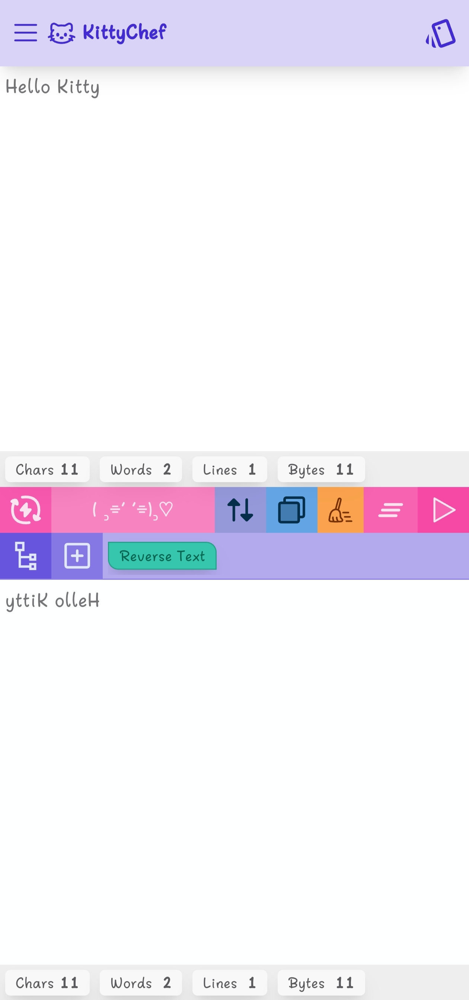
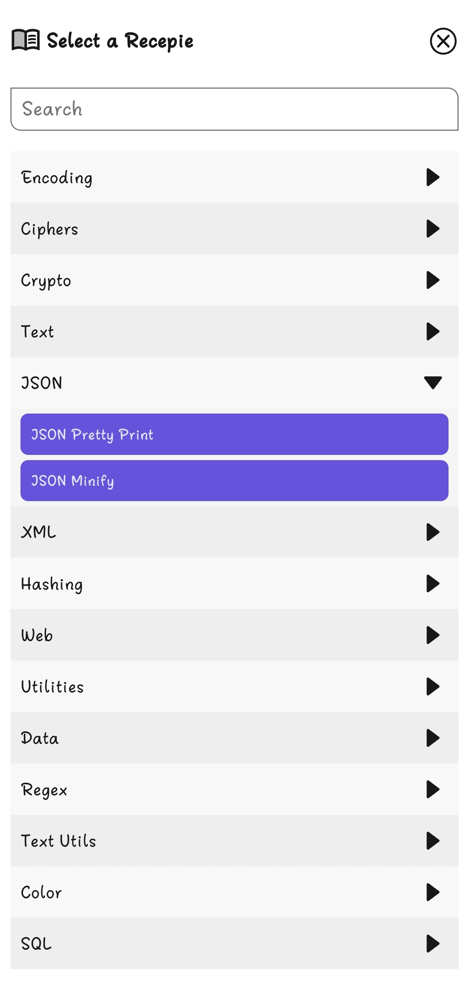
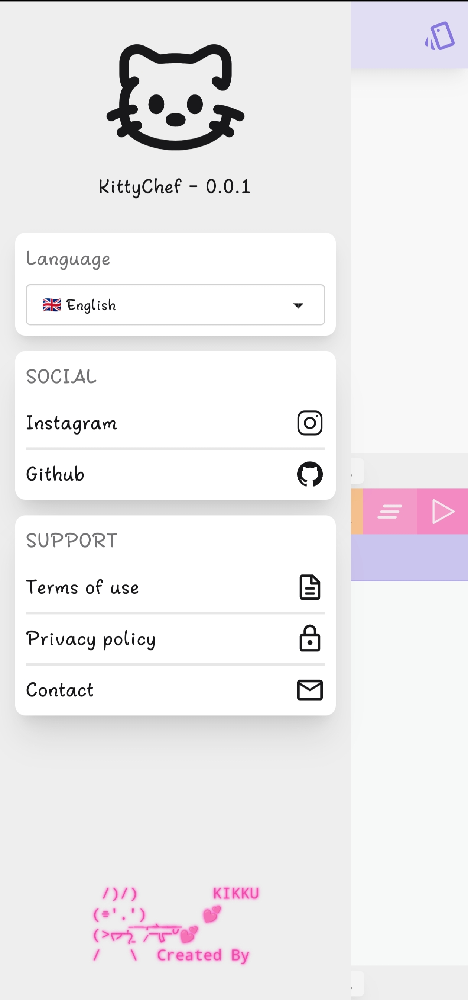

# 🐱 KittyChef  
### A Mobile-First CyberChef Alternative

KittyChef is a fast, lightweight, mobile-optimized data transformation toolkit inspired by CyberChef — but designed **specifically for phones**.  
Encode, decode, convert, encrypt, and chain multiple operations together using a beautiful recipe pipeline system.

---

## 🚀 Features

### 🔧 Encoding & Decoding
- Base64 Encode / Decode  
- Hex Encode / Decode  
- URL Encode / Decode  
- ROT13  
- XOR  
- Text case converters  
- And more…

### 🧪 Recipe Pipeline
- Add multiple modules  
- Reorder modules (soon)  
- Customize module options  
- Run entire pipeline at once  
- Auto-run (Live Mode)

### ⚡ Quick Insights
Shows:
- Character count  
- Word count  
- Line count  
- UTF-8 byte size  

Works for both input & output.

### 🎛 Mobile-Optimized UI
- Smooth animations  
- Bottom sheets  
- Touch-friendly interactions  
- Module picker with search  
- Fast copy / auto-select output

### 🧰 Utility Tools (coming soon)
- Quick actions (trim, sort lines, remove empty lines, etc.)  
- Auto-detect encoding  
- Magic decode  
- Saved recipes  

---

## 🛠 Tech Stack

| Layer         | Tech |
|---------------|------|
| Framework     | Vue 3 (Composition API) |
| UI Styling    | TailwindCSS + DaisyUI |
| Animations    | Vue Transitions |
| Build Tool    | Vite |
| State         | Refs + computed properties |
| Icons         | Iconify / Custom SVG |

---

## ▶️ Running Locally

git clone https://github.com/luvbyte/kittychef.git
cd kittychef

pnpm install

pnpm run dev

Visit:

http://localhost:5173

---

🐾 Why KittyChef?

CyberChef is amazing — but its UI doesn’t feel great on mobile.
KittyChef fixes that with:

A smaller, touch-friendly UI

Faster module selection

Bottom-sheet option editor

Simple & clean pipeline layout

Instant insights

---

📸 Screenshots

---

🔮 Roadmap

[ ✓ ] Quick Utils (trim / sort / dedupe)

[ ✓ ] Save / load recipes

[ ] Auto-detect encoding

[ ] Binary inspector

---

🤝 Contributing

Contributions are welcome!
You can help with:

Adding new modules

Improving UI/UX

Adding utilities

Fixing bugs

Writing documentation

Open a PR or create an issue!

